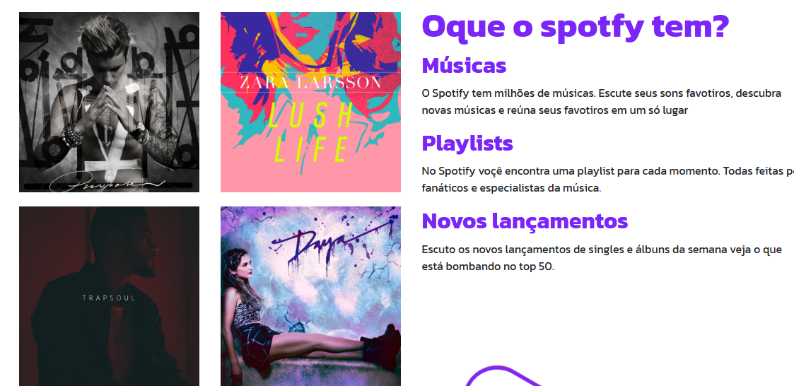

# Clone da Página Inicial do Spotify

Este projeto é um **clone** da página inicial do Spotify, criado para praticar o uso do **Bootstrap** e seu sistema de grid.

## 🚀 Tecnologias

- HTML5
- CSS3
- Bootstrap (Grid System)

## 🎯 Objetivo

O foco deste projeto foi:

- Recriar a interface inicial do Spotify com fidelidade visual
- Usar exclusivamente o sistema **grid** do Bootstrap para organizar o layout
- Garantir a **responsividade** em diferentes dispositivos (desktop, tablet e mobile)

## 🔗 Visualização

https://viniciosros4.github.io/Clone-da-Pagina-Inicial-do-Spotify/

## 📷 Preview

